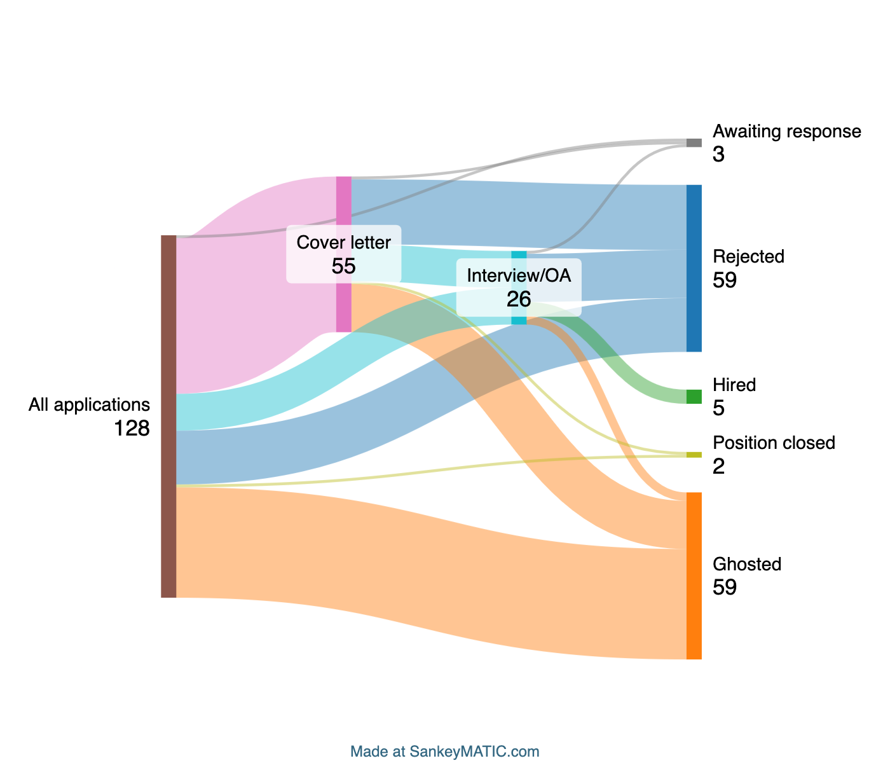
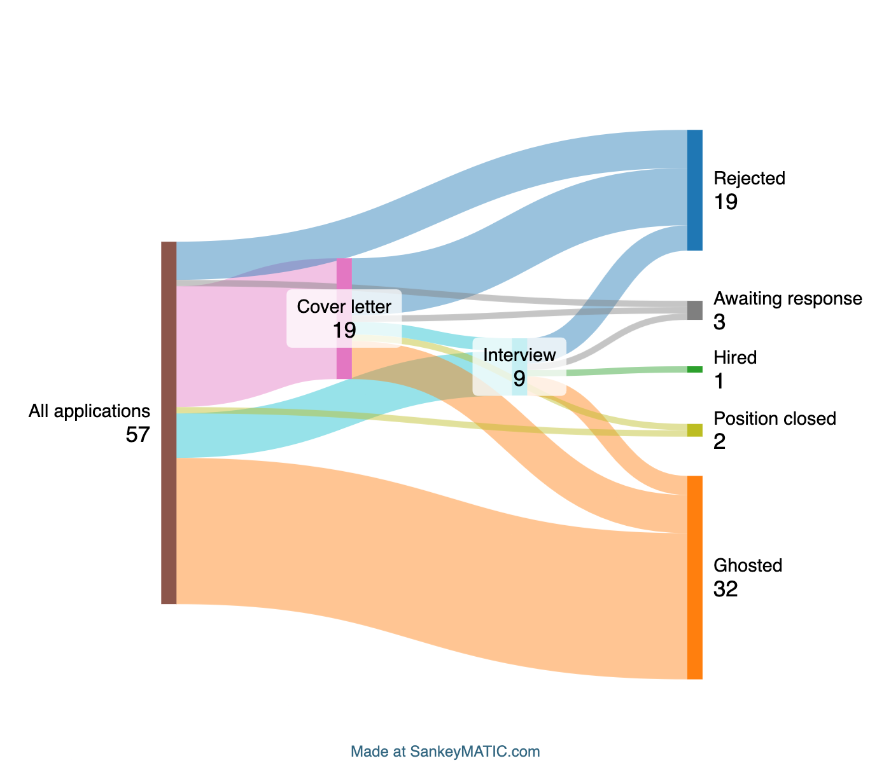

# Job applications statistics
Throughout my time at university, I've applied to many summer internships,
summer retail jobs, research labs, and full-time jobs. The slightly concerning
job application data from
[r/DataIsBeautiful](https://www.reddit.com/r/dataisbeautiful/) inspired me to
make this; I thought it would be nice to see how successful (or not) my
applications were. It looks like I've done tolerably well.

**`analyze_all.py` generates SankeyMATIC-formatted data from a CSV** downloaded
from a Notion database.

`extract_career_only.py` is a script which selects only full-time positions from
a given CSV.

## Usage
To specify only
For all applications:
1. Export your entire job applications database from Notion, keeping all default
   settings except "Include content: No files or images". The downloaded zip
   should contain two identical CSVs. Put one of them into the `/data`
   directory.
	- To consider only applications to career positions, run
	  `extract_career_only.py data/ALL_APPS.csv data/CAREER_ONLY.csv`.
2. Run `analyze_all.py data/ALL_APPS.csv`.
3. Use the Sankey-formatted data from the script output to [create a Sankey
   diagram](https://www.sankeymatic.com/build/).


## Results
### All applications throughout undergrad
Here is the data for all the jobs I applied to throughout my undergrad:
```
All applications [55] Cover letter
Cover letter [1] Awaiting response
All applications [1] Awaiting response
Cover letter [1] Position closed
Cover letter [13] Interview/OA
Interview/OA [1] Awaiting response
All applications [19] Rejected
All applications [39] Ghosted
Cover letter [17] Ghosted
Cover letter [23] Rejected
All applications [13] Interview/OA
Interview/OA [17] Rejected
Interview/OA [3] Ghosted
All applications [1] Position closed
Interview/OA [5] Hired
All applications [1] Hired
```


### Career only
Here is the data for the full-time career positions I applied to in senior year:

```
All applications [19] Cover letter
Cover letter [1] Awaiting response
All applications [1] Awaiting response
Cover letter [1] Position closed
Cover letter [2] Interview/OA
Interview/OA [1] Awaiting response
All applications [6] Rejected
All applications [23] Ghosted
Cover letter [6] Ghosted
Cover letter [9] Rejected
All applications [7] Interview/OA
Interview/OA [4] Rejected
Interview/OA [3] Ghosted
All applications [1] Position closed
Interview/OA [1] Hired
```


## Resources
- [Notion](https://www.notion.com/) - for everyday logging
- [Python CSV library](https://docs.python.org/3/library/csv.html) - for parsing
  the CSV downloaded from Notion
- [SankeyMATIC](https://www.sankeymatic.com/build/) - for creating the flow
  diagrams
